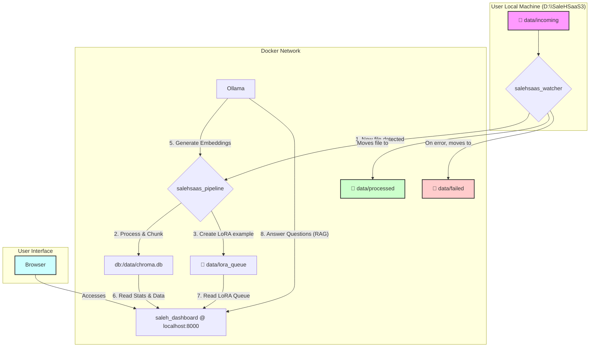

## 🕋 System Architecture - معمارية النظام

This diagram illustrates the complete workflow of the SaleH SaaS ecosystem, from file ingestion to the user-facing dashboard.

### Workflow Steps (خطوات سير العمل)

1.  **File Ingestion (إدخال الملفات)**: The user places a file (PDF, DOCX, TXT, MD) into the `D:\SaleHSaaS3\data\incoming` directory on their local machine.
2.  **File Watcher (مراقب الملفات)**: The `salehsaas_watcher` service, running every 10 seconds, detects the new file.
3.  **Data Pipeline (خط أنابيب البيانات)**: The watcher sends the file to the `salehsaas_pipeline` API.
    - The pipeline uses `unstructured` to parse the document content.
    - It splits the text into smaller chunks (1024 tokens each).
    - It calls **Ollama (nomic-embed-text)** to generate vector embeddings for each chunk.
    - The chunks and their vectors are stored in the **ChromaDB** vector database in the `salehsaas_knowledge` collection.
    - A JSONL entry is created and saved in the `data/lora_queue` folder for future fine-tuning.
4.  **File Archiving (أرشفة الملفات)**: After successful processing, the `salehsaas_watcher` moves the original file to the `data/processed` directory. If an error occurs, it is moved to `data/failed`.
5.  **Dashboard (لوحة المراقبة)**: The `saleh_dashboard` service provides a web interface at `http://localhost:8000`.
    - It reads statistics directly from ChromaDB and the file system (`incoming`, `processed`, `failed`, `lora_queue`).
    - It checks the health of all other services.
    - It provides a **Chat UI** that uses a RAG (Retrieval-Augmented Generation) pipeline:
        - A user's question is sent to the dashboard's API.
        - The API generates embeddings for the question using **Ollama**.
        - It queries **ChromaDB** to find the most relevant chunks from the knowledge base.
        - It sends the question and the retrieved chunks as context to **Ollama (Llama 3)**.
        - The LLM generates an answer based on the provided context, which is then streamed back to the user.
